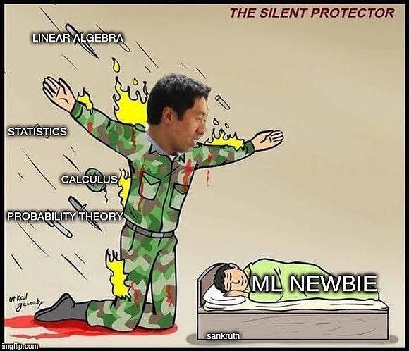

## Python

- [Sololearn](https://www.sololearn.com/learning)
- [Datacamp](https://www.datacamp.com/)
- [Asabeneh/30-Days-Of-Python](https://github.com/Asabeneh/30-Days-Of-Python)
- [The Algorithms](https://github.com/TheAlgorithms/Python)
- [Python Programming And Numerical Methods: A Guide For Engineers And Scientists](https://pythonnumericalmethods.berkeley.edu/notebooks/Index.html)

## Statistics and Probability

- [OpenStax](https://openstax.org/books/introductory-statistics/pages/1-introduction)
- [Stanford.edu - CME 106](https://stanford.edu/~shervine/teaching/cme-106/cheatsheet-statistics)
- [Stanford.edu - CME 106](https://stanford.edu/~shervine/teaching/cme-106/cheatsheet-probability)
- [Video - Tutorial Belajar Statistika Dasar | Belajar Statistika Deskriptif](https://youtube.com/playlist?list=PL2O3HdJI4voGM2gNYekQcUhjGRXbahMEd)
- [Video - Rekaman Kuliah Statistika Inferensi | Kuliah Online | Kuliah Daring | Pembelajaran Jarak Jauh | PJJ](https://youtube.com/playlist?list=PL2O3HdJI4voHcIO22VkkBvbxBTYh2AHSP)
- [Video - Tutorial Belajar Probabilitas Dasar](https://youtube.com/playlist?list=PL2O3HdJI4voHDdTtwsGZ60uSPyYHB6KHb)

## Data Analysis

- [Video - Tutorial Belajar Python Pandas | Tips & Tricks | Belajar Data Science | Bahasa Indonesia](https://youtube.com/playlist?list=PL2O3HdJI4voGdD_9xhVCTBoDTDNHpajm5)

## Data Visualization

- [Video - Tutorial Belajar Visualisasi Data Dasar | Python Matplotlib](https://youtube.com/playlist?list=PL2O3HdJI4voHrfoMFvkDeblmjarDN8nC8)

## Data Science

- [Data Science For Beginners](https://microsoft.github.io/Data-Science-For-Beginners/#/)

## Machine Learning

- [Scikit Learn](https://scikit-learn.org/)
- [mlcourse.ai](https://mlcourse.ai/book/index.html)
- [Kaggle Courses](https://www.kaggle.com/learn)
- [Stanford.edu - CS 229](https://stanford.edu/~shervine/teaching/cs-229/)
- [Video - Tutorial Belajar Machine Learning Dasar | Python Scikit-Learn](https://youtube.com/playlist?list=PL2O3HdJI4voHNEv59SdXKRQVRZAFmwN9E)
- [Twitter - Santiago](https://twitter.com/svpino)
- [Twitter - Barry Cavin](https://twitter.com/barrysianturi)
- [Twitter - Tivadar Danka](https://twitter.com/TivadarDanka)

## Deep Learning

- [Dive Into Deep Learning](https://d2l.ai/index.html)
- [PyTorch Tutorials](https://pytorch.org/tutorials/)
- [Stanford.edu - CS 230](https://stanford.edu/~shervine/teaching/cs-230/)
- [Jake Tae](https://jaketae.github.io/posts/)

## Image Processing
- [Interpretasi dan Pengolahan Citra oleh Rinaldi Munir](https://youtu.be/xi2V6YzdL5o)

## Forecasting

- [Forecasting: Principles and Practice by Rob J Hyndman and George Athanasopoulos - Monash University, Australia](https://otexts.com/fpp2/)
- [Sktime Tutorials](https://www.sktime.org/en/stable/tutorials.html)
